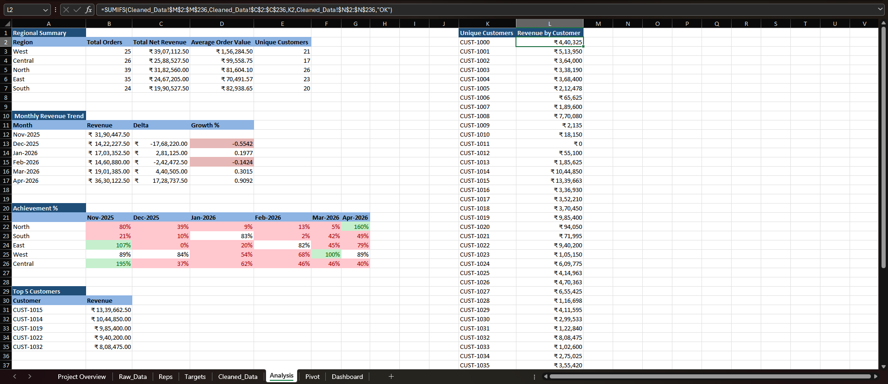
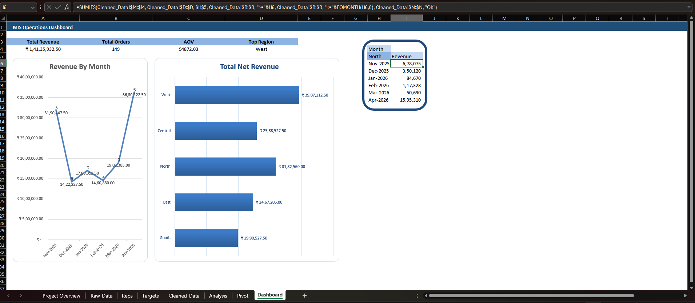

# Business Performance MIS Dashboard 📊

An end-to-end **Excel-based MIS (Management Information System) dashboard** project that demonstrates a complete analytics workflow — from **raw data → cleaned dataset → pivot tables → analysis → interactive dashboard**.

## Files in this Repo
- **Workbook:** `Business Performance MIS Dashboard.xlsx`
- **Screenshots:** `images/`
  - `images/Cleaned Data.png`
  - `images/Pivot Table.png`
  - `images/Analysis.png`
  - `images/Dashboard.png`

## Workflow (What I did)
1. **Data Cleaning** — prepared a usable dataset for reporting.
2. **Pivot Tables** — built reporting tables to summarize performance.
3. **Analysis** — derived insights from the pivot outputs.
4. **Dashboard** — created a single-page MIS dashboard for decision-making.

## Previews (GitHub renders these as thumbnails) ✅

### Cleaned Data

### Pivot Table

### Analysis

### Dashboard

## How to Use
1. Download the repo (or just the `.xlsx` file)
2. Open `Business Performance MIS Dashboard.xlsx` in Microsoft Excel
3. Review the sheets in order: **Cleaned Data → Pivot Table → Analysis → Dashboard**

---
If you'd like, I can also share a **Power BI version** of the same dashboard flow (data model + DAX + visuals). 🚀
